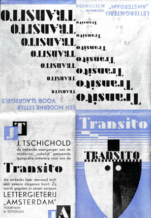
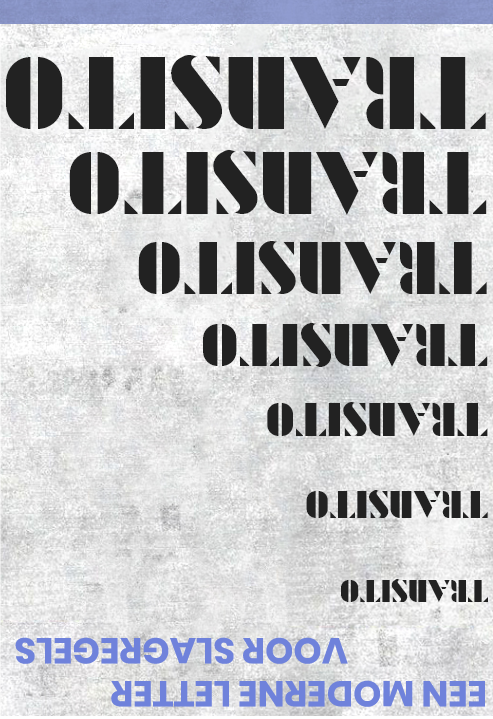

# Daily Layout No.02
*Web adaptation (partial) of Jan Tschichold's poster for promoting his typography Transito*

[Click here to see the page](https://tricktrap.mx/labs/daily-layout-01/)

This is the second entry of Daily Layout. Today's example was easier than the first one, but I could learn a lot from it and stumbled upon an issue (still open) while using two propeties at the same time for landscape mode in mobile devices. 

In this particular example I was able to experiment with:

+ Clamp\(\) property for font sizes
+ VW and VH units
+ Transformations and rotations

### Here is a copy of the original version I use for reference:

### Due to it's modular design I grabbed just the fist section and retraced it to create a Hifi reference:

### The web version, flexible and responsive:

I used one media query for small mobile sizes, I'm still experimenting with clamp property so I'm not able to fit every viewport size with it. Also, some element hide when using landscape modes on mobile devices.

**Feel free to play around with it**

Don't forget to checkout my other repositories for more examples.

### Thank you!
